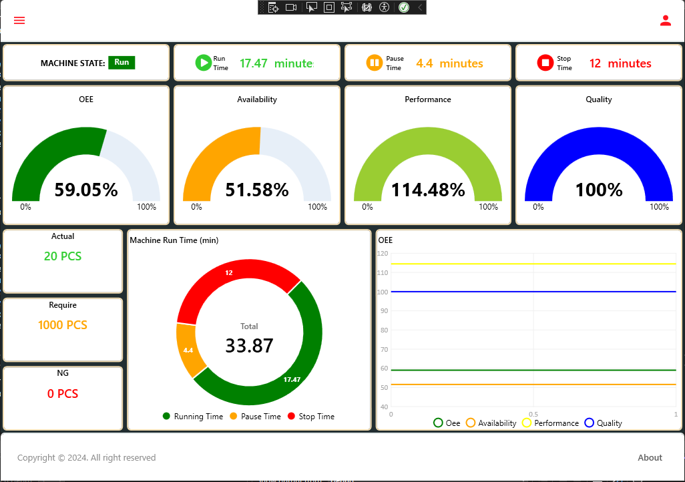
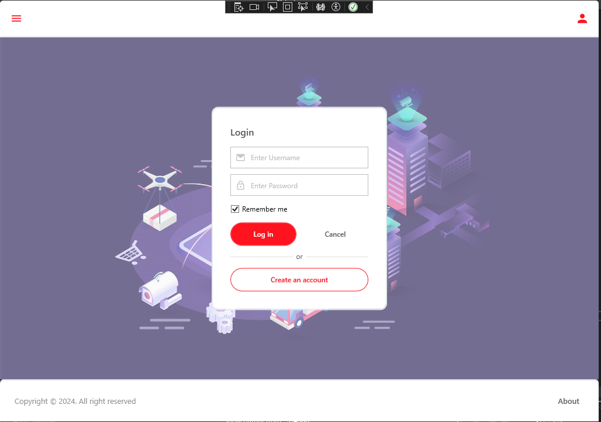
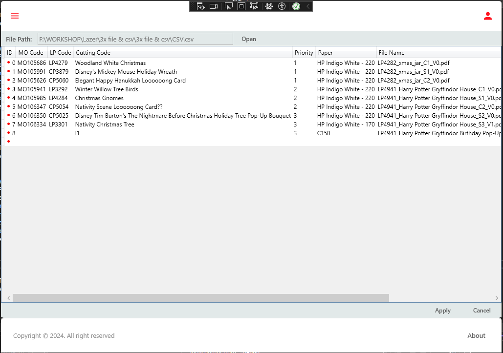
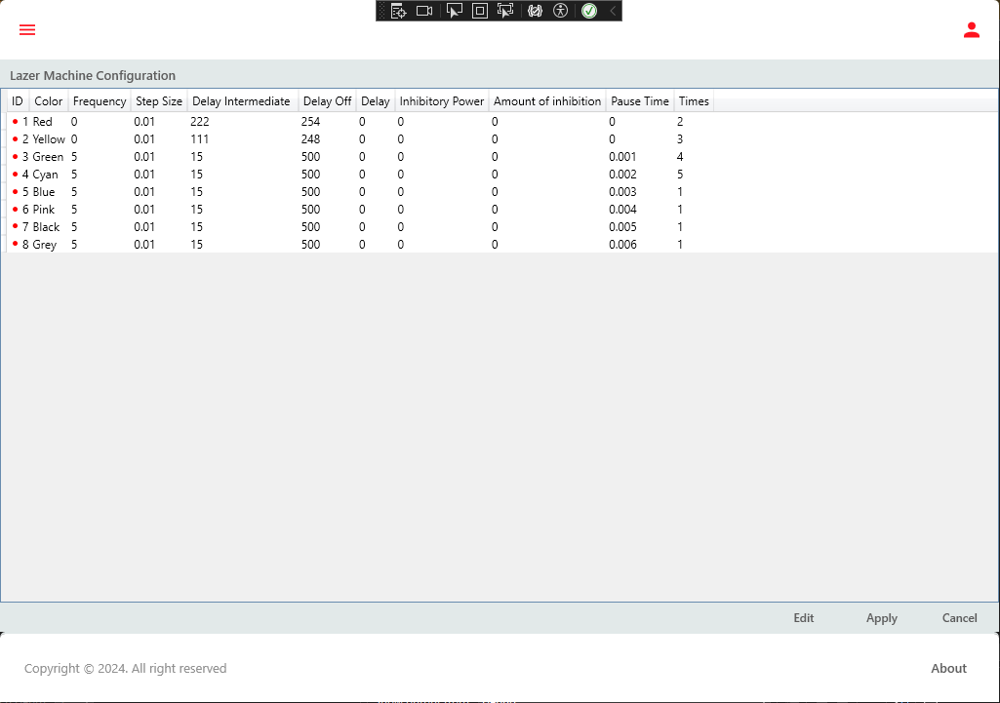
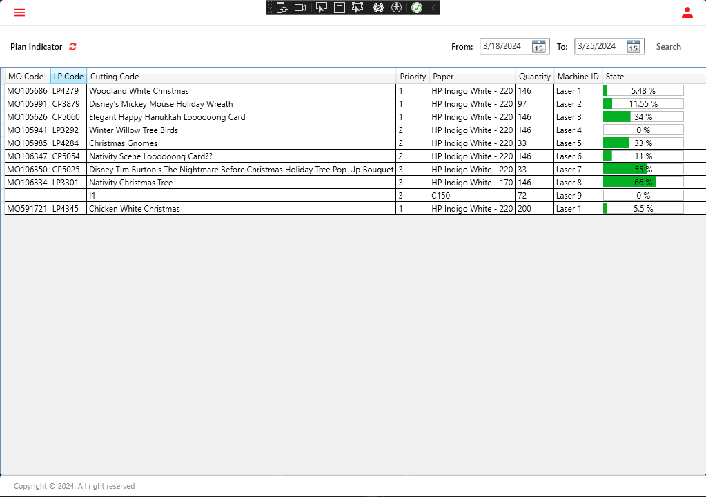

# OEE Application
https://github.com/CalisJI/OEE_Lovepop.git

# Screenshot






# API 
- using RESTFul API to communicate with another application like (Node-red, web API, etc...)
- Using These NuGet: Microsoft.AspNet.WebApi.Owin; Microsoft.Owin.Host.HttpListener; Microsoft.Owin.Hosting; Microsoft.AspNet.WebApi.OwinSelfHost
```csharp 

// Define a self server host to lister request
var config = new HttpSelfHostConfiguration("http://0.0.0.0:5001"); // open port 5001
config.Routes.MapHttpRoute("API Default", "api/{controller}/{action}/{id}", new { id = RouteParameter.Optional, action = RouteParameter.Optional });
var server = new HttpSelfHostServer(config);
server.OpenAsync().Wait();


```

```csharp
//Get request

[Route("Get_machine_runtime")]
[HttpGet]
public IHttpActionResult Get_machine_runtime() 
{
    try
    {
                
        return Ok();
    }
    catch (Exception)
    {
        return NotFound();
    }
} 

```

# ZeroMQ
- Using to subscribe and publish message through each node applications in local network
- Using this NuGet: [NetMQ](https://netmq.readthedocs.io/en/latest/pub-sub/)
```csharp
//Subscriber --- use in subscriber mode (Workstation mode)
public static void Initialize_Subcriber(string topic) 
{
    Task.Run(() =>
    {
        using (var subscriber = new SubscriberSocket())
        {
            subscriber.Connect("tcp://127.0.0.1:5556");
            subscriber.Subscribe(topic);

            while (true)
            {
                topic = subscriber.ReceiveFrameString();
                var msg = subscriber.ReceiveFrameString();
                Debug.WriteLine("From Publisher: {0} {1}", topic, msg);
            }
        }
    });
}
```
```csharp
//Publisher use in Plan option
/// <summary>
/// Publish message to subscribers in network (Workstation node)
/// </summary>
/// <param name="mQMessage"></param>
public static async Task Publisher_MQ(MQMessage mQMessage) 
{
    using (var publisher = new PublisherSocket())
    {
        publisher.Bind("tcp://*:5556");
        await Task.Delay(500);
        if (mQMessage!=null && mQMessage.Topic!=null && mQMessage.Content!=null) 
        {
            publisher
                .SendMoreFrame(mQMessage.Topic) // Topic
                .SendFrame(mQMessage.Content); // Message 
        }
    }
}
```
# Working with Database
- Using DatabaseExcute_Main

# Dashboard Web

- Using DashboardHtml Folder and that is in development 


# Configurate settings for Application
- Class: ApplicationConfig.cs
Using to store Initial settings configuration for application

```csharp
public static class ApplicationConfig
{
    private static string FilePath = Directory.GetCurrentDirectory() + @"/Settings.json";
    public static string Datapath = Directory.GetCurrentDirectory() + @"/Data.dat";
    public static SettingParameter SettingParameter;

    public static void GetConfig() 
    {
        try
        {
            if (!File.Exists(FilePath))
            {
                SettingParameter = new SettingParameter()
                {
                    Machine_Id = "Laser 1",
                    Remember_me = true
                };
                UpdateConfig(SettingParameter);
            }
            else
            {
                string jsonString = File.ReadAllText(FilePath);
                SettingParameter = JsonConvert.DeserializeObject<SettingParameter>(jsonString);
            }
        }
        catch (Exception ex)
        {
            MessageBox.Show(ex.Message);
        }
    }

    public static void UpdateConfig(SettingParameter setting) 
    {
        try
        {
            string jsonString = JsonConvert.SerializeObject(SettingParameter, Formatting.Indented);
            File.WriteAllText(FilePath, jsonString);
        }
        catch (Exception ex)
        {
            MessageBox.Show(ex.Message);
        }
            
    }

}

//Settings Parameter Model

public class SettingParameter
{
    public string? Machine_Id { get; set; }
    public bool Remember_me { get; set; }
    public int DecrypLength { get; set; }
}
```

